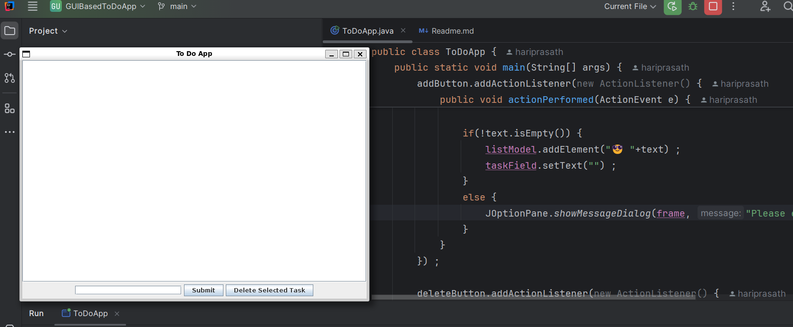
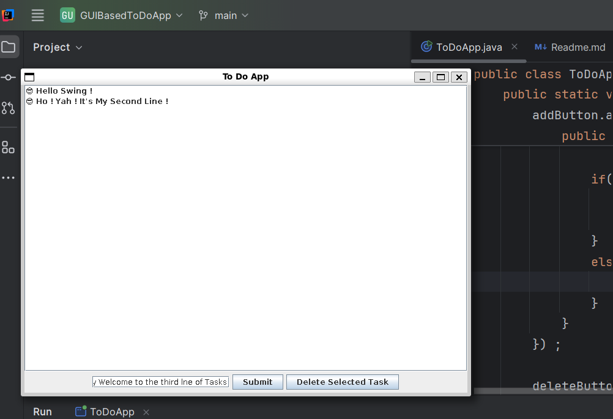
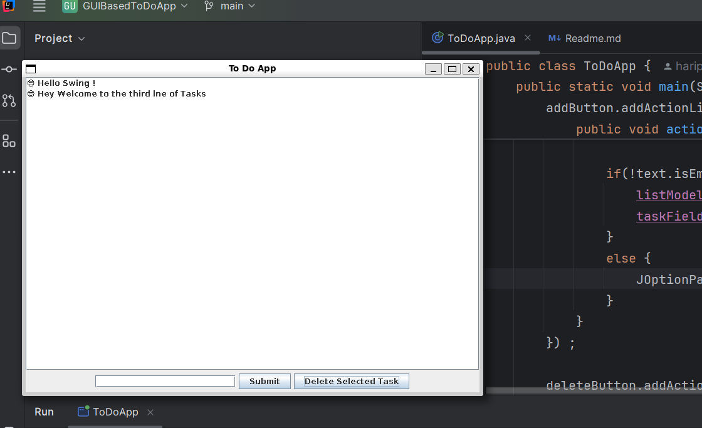

# ✅ Java Swing To-Do App

---

## ✨ Features

- 📝 Add tasks to your list instantly
- ❌ Delete selected tasks
- 📋 View all tasks in a scrollable view
- 📦 Built with Java Swing & Object-Oriented Design
- 🖥️ No internet required — works completely offline!

---

## 📸 Demo

  
*🧭 The main menu interface with task input*

  
*✅ Adding a new task using the input box*

  
*❌ Deleting a selected task from the list*

---

## 📁 Project Structure

```
swing-todo-app/
├── ToDoApp.java
├── README.md
├── images/
│   ├── menu.png
│   ├── add-task.png
│   └── delete-task.png

```

---

## 🚀 How to Run

### 1. Compile the project

```
bash
javac ToDoApp.java
```

### 2. Run the application
```
java ToDoApp
```

---

## 🛠 Tech Stack

- ☕️ Java SE — Core language for the application
- 🪟 Java Swing — Lightweight desktop GUI
- 🖥️ Desktop CLI/GUI — Standalone, no server required
- 🛠️ Git & GitHub — Version control and collaboration

---

## 🔮 Future Improvements

- ✅ Checkbox to mark completed tasks
- 📁 Save tasks to a file (persist after restart)
- ⏱ Add timestamps to each task
- 🎨 Custom fonts/colors for better UI
- 🖼 Build a JavaFX version with modern design

---

## 🙋‍♂️ Author

Made with ❤️ by **[!HARI PRASATH K](https://github.com/hariPrasathK-Dev)**  
🚀 Java Developer Intern @ **Elevate Labs**

---

## ⭐ Show Your Support

If this project helped or inspired you:

- ⭐ Star the repository
- 🍴 Fork the repo and extend it your way
- 🔁 Share it with others

> ✍️ "A task written is a task halfway done."

---